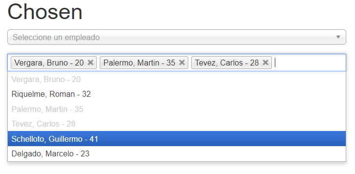

# Librerias

### Chosen

### DataTable

### TableSorter

### Pace

### Alertify

### Chart Bar

### Chart Lineal

### Chart Radar

### Chart  Polar

### Chart Bubble

### Chart Circle Fill

### Chart Circle Doughnut

